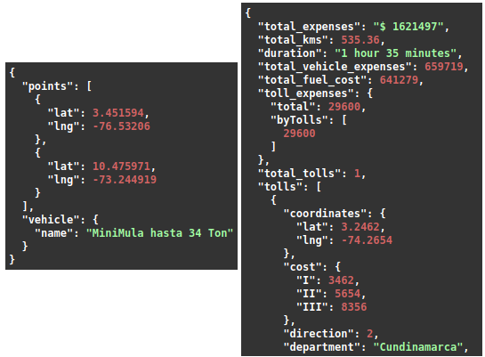
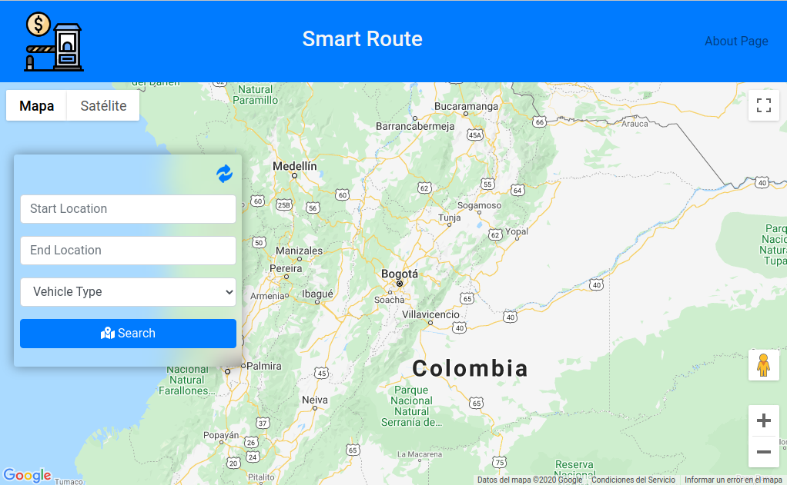

# SmartRoute REST API


## Portfolio Project for Holberton School

This project is made by the FullDevs Team as a portfolio project for the final project in the end of Foundation in Holberton School. This project is based on the challenge proposed by Quick Company which is a logistics transportation company, the problem they have is that in some transportation routes they calculate the freight costs by using fixed costs values on specific routes.
We as a Team we try to solve this problem by developing a Rest API that provide the service of the cost calculation that carries a route according to a vehicle.


### Sample:

Screenshot:



[SmartRoute API](https://api.fulldevs.software): API URL


*Web app implementing the main service:




[Web Application](https://smartroute.fulldevs.software): Web application that uses the API to provide a visualization of the service

(*) Web application located in another repository

[SmartRoute Web Application](https://github.com/jeffleon/Front-End-Quick): Web application repository


## Why this project is useful?

Our solution provides the cost calculation within a route (currently for Colombia), the optimize route between an origin place and destination place, the tolls within a route, distance and duration of the trip, CRUD operation for data vehicles, CRUD operation for data tolls.


## How users can get started with?

### pre-requisite
Before starting, it is necessary to have already installed and configured in your system:
  - Git ver. 2.11+
  - NodeJS ver. 12.16.1+
  - Redis ver. 6.0.8+ (running on port 6379)
  - MongoDB ver. 4.2.10+
  
Google Maps and OpenRouteService Maps API KEY's.

Check these pages for more information about API KEY's:

- https://cloud.google.com/maps-platform/
- https://openrouteservice.org/

### start 🚀

Clone the repository to have the local project:
``` sh
git clone git@github.com:SneyderHOL/Quick_Project.git
```
Get inside the path of the project:
``` sh
cd Quick_Project
```
Installing dependecies:
``` sh
npm install
```
Declare the following variables inside the file .env:
``` sh
- GOOGLE_API=(here goes your google API key)
- API_OPENROUTES=(here goes your openrouteservice API key)
- URL_DB=mongodb://localhost (if you're using a local MongoDB)
```
Start the application with:
``` sh
npm start
```
Now you can start using the API with the following endpoints:

- /tolls
- /vehicles
- /routes/tolls

You can check the API documentation within a browser in:

- /api-docs


## Built with 🛠️

Programming Language: JavaScript

JavaScript Runtime Environment:
- NodeJS

Frameworks:
- Express

Libraries:
- Mongoose
- Morgan
- Node-fetch
- Swagger
- IORedis
- Jest
- Dotenv


## Information 🗒

The following resources were needed for the development of this project:

- [ ]  Information about the vehicles was obtained through the company Quick and from the following resources:
-  https://www.budgetdirect.com.au/car-insurance/research/average-fuel-consumption-australia.html
-  https://drive.google.com/file/d/1chP-YlXZpYQj-agxaqHkMldBp3LxymDB/view?usp=sharing
-  https://drive.google.com/file/d/1GA9R69hIzqO9SgXhE8PKEXwyD4NKY5N5/view?usp=sharing
-  https://theicct.org/sites/default/files/publications/HDVemissions_oct09.pdf
-  https://dspace.ups.edu.ec/bitstream/123456789/10009/1/UPS-GT001116.pdf


- [ ]  For more information on toll collection, you can follow the following repository:
-  https://github.com/andresvanegas19/tolls-colombia-2020


[API peajes](https://api-tolls.herokuapp.com/api-docs): It is a service with updated toll prices
in Colombia


[API Google Routes](https://developers.google.com/maps): A service provided by google where it predicts
which is the most suitable route to reach the destination.


## By FullDevs Team: 🗒

- Juan Carlos Rengifo      - Front-end
- Jefferson Alexander Leon - Front-end/Back-end
- Eduard Sneyder Amador    - DevOps/Back-end
- Andres Santiago Reyes    - Back-end
