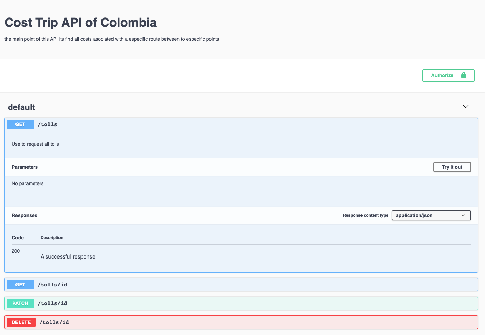

# Quick project
## API rest

Este proyecto da solucion al problema de calcular el costo total del viaje por una ruta con precision.
Este problema se da ya debido a la falta de informacion, por ende el proyecto brinda la solucion del
desarrollo de una API Rest que realice el cálculo de gastos incurridos en un trayecto que incluya gastos
fijos y variables así como los costos incurridos en peajes según la ruta.

Para poder ver el funcionamiento de este se hara una interfaz grafica donde se mostraran las ruta donde
consultar y una guia para el uso de esta API


El siguiente JSON es el resultado que esperamos entregar a la hora de solicitar nuestro servicio.
```
{
    "fuel_price": 420000,
    "total_kms": 1207,
    "duration": "32h",
    "other_expenses": 165000,
    "tolls": {...},
    "path": {...},
    "total_price": 1525000,
    ...
}
```

Para el desarrollo de este proyecto se necesitaron los siguientes recuros


se tiene una api en esta ruta

https://github.com/jeffleon/Quick/tree/master


## start
The following instructions will allow you to obtain a copy of the local project for development and testing purposes


# installation and use the proyect
### pre-requisite
It is advisable to run the project on Ubuntu 14.04 LTS to have no failures in the program and in the project


For start this proyect you need docker


```
docker-compose up -d
```

if you end to develop or fix execute this:

```
docker-compose down
```


# Running the tests


### Built with 🛠️
The core language used to develop the application is
- Node.js

The libraries that will be used to develop the application are:
- mongoose to use all the information as NoSQL
- JWT for API authentication and security
- Swagger for API documentation
- Bodyparser

Frameworks:
- Express


### authors 🗒
- Andres Santiago Reyes DevOps
- Juan Carlos Rengifo Back-end/
- Jefferson Alexander Leon Back-end
- Eduard Sneyder Amador DevOps
